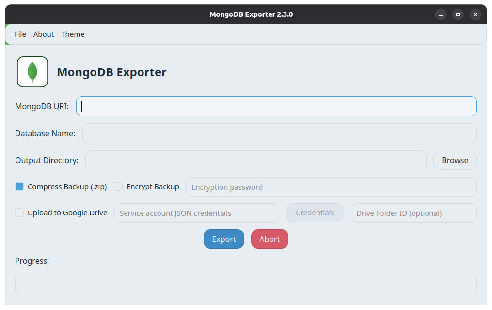
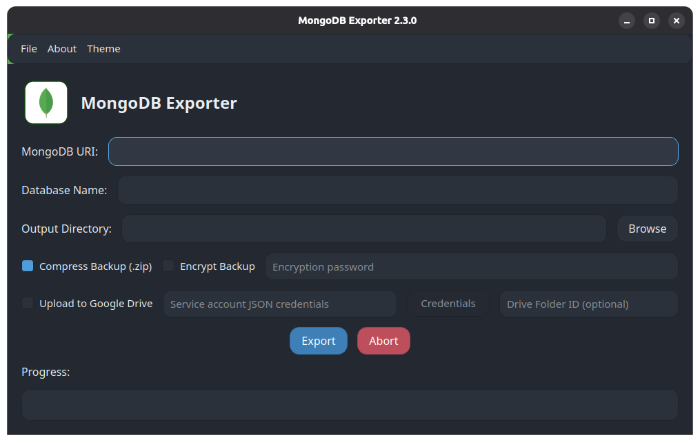

# MongoDB Exporter GUI

## Overview

MongoDB Exporter GUI is a desktop application built with `PySide6` that exports MongoDB collections into JSON backups with a modern interface. It supports optional compression, AES encryption, and in-app decryption.

## Features

- Elegant neumorphism-based UI.
- Theme switcher with `System` (default), `Light`, and `Dark` modes.
- Connect to any MongoDB database using URI.
- Export all non-empty collections as JSON.
- Auto-create a dated backup folder in output directory.
- Optional backup compression to `.zip`.
- Optional backup encryption to `.enc` using AES-GCM.
- Optional Google Drive upload for generated backup files.
- In-app backup decryption from `File -> Decrypt Backup`.
- Real-time progress updates during export/compress/encrypt/decrypt.
- Export/Import backup scripts using `.mdbexport`.
- Built-in update checker.
- About dialog with developer info.

## Prerequisites

- Python 3.x
- `pymongo`
- `PySide6`
- `requests`
- `cryptography`
- `google-api-python-client`
- `google-auth`
- `google-auth-httplib2`

## Installation

```bash
pip install -r requirements.txt
```

## Build (Linux)

Prerequisites:
- `pyinstaller`
- `dpkg-deb` (for Debian package)
- `curl` (only if `appimagetool` is not already installed)

Build commands:

```bash
# Build both .deb and .AppImage
./build_linux.sh --all

# Build only Debian package
./build_linux.sh --deb

# Build only AppImage
./build_linux.sh --appimage

# Clean build artifacts
./build_linux.sh --clean
```

Compatibility wrappers:
- `./build.sh` -> same as `./build_linux.sh --deb`
- `./build_appimage.sh` -> same as `./build_linux.sh --appimage`

Output artifacts are generated in `release/`.

## Usage

1. Launch the app.
2. Enter MongoDB URI, database name, and output directory.
3. Choose backup options:
   - `Compress Backup (.zip)`
   - `Encrypt Backup` + password (minimum 8 characters)
   - `Upload to Google Drive` + service account JSON (+ optional folder ID)
4. Click `Export`.

## UI Screenshot

Light theme:



Dark theme:



## Backup Process

1. Set `MongoDB URI`, `Database Name`, and `Output Directory`.
2. Click `Export`.
3. App creates a dated folder with JSON exports.
4. If `Compress Backup (.zip)` is enabled, a ZIP archive is created.

## Encryption Process

1. Enable `Encrypt Backup`.
2. Enter a password (minimum 8 characters).
3. Run export.
4. App creates encrypted backup file: `.zip.enc`.

## Decrypt Backup

1. Open `File -> Decrypt Backup`.
2. Select encrypted backup file (`.enc`).
3. Enter password.
4. Choose save location for decrypted file (usually `.zip`).

## Google Drive Upload Setup

1. Open Google Cloud Console:
   - `https://console.cloud.google.com/`
2. Create or select a project:
   - `https://console.cloud.google.com/projectcreate`
3. Enable Google Drive API:
   - `https://console.cloud.google.com/apis/library/drive.googleapis.com`
4. Create a Service Account:
   - `IAM & Admin -> Service Accounts`
   - Direct link: `https://console.cloud.google.com/iam-admin/serviceaccounts`
5. Open the service account -> `Keys` tab -> `Add Key -> Create new key -> JSON`.
6. Download the JSON credentials file and use this file in the app (`Credentials` button).
7. Share your target Google Drive folder with the service account email.
   - Example: `my-service-account@project-id.iam.gserviceaccount.com`
8. Copy Drive Folder ID from folder URL (optional).
   - Example URL: `https://drive.google.com/drive/folders/<FOLDER_ID>`

## Google Drive Upload Process

1. Enable `Upload to Google Drive`.
2. Select service account JSON using `Credentials` button.
3. Optionally enter `Drive Folder ID`.
4. Start export.
5. App uploads generated backup artifact:
   - If encryption enabled: uploads `.enc`
   - Else: uploads `.zip`
6. Final success message includes Google Drive file ID and web link.

## Backup Script (`.mdbexport`)

- `File -> Create Backup Script`: saves connection + export options (password is not stored).
- `File -> Load Backup Script`: restores saved values and optionally starts export.

---

## Changelog

### Version 2.4.0

- Added neumorphism QSS UI styling.
- Added theme switcher (`System`, `Light`, `Dark`).
- Added backup options for compression and encryption.
- Added optional Google Drive upload using service account credentials.
- Added AES-GCM encrypted backup generation (`.enc`).
- Added in-app encrypted backup decryption flow.
- Added `cryptography` dependency.
- Improved progress messaging for processing stages.

<details>
<summary>Previous Versions</summary>

### Version 2.3.0

- Add About Page
- Add Developer Info

### Version 2.2.2

- Add new file extension `.mdbexport`
- Make code modular
- Add Check For Update option

### Version 2.2.1

- Introduced `.mdbexport` file format
- Refactored into a modular codebase

### Version 2.2.0

- Add Export/Import script support

### Version 2.1.0

- Auto-dated output folder
- Zip after export

### Version 2.0.2

- Change default font to Roboto
- Add watermark logo

### Version 2.0.1

- Confirmation dialog before export
- Abort button with progress tracking
- Fixed UI freeze during large exports

</details>

---

## Download

- Windows: [MongoDBExporter-Setup.exe](https://github.com/Sarwarhridoy4/MongoDB-Exporter/releases/latest/download/MongoDBExporter-Setup.exe)
- Linux `.deb`: [mongodbexporter_2.3.0_amd64.deb](https://github.com/Sarwarhridoy4/MongoDB-Exporter/releases/download/2.3.0/mongodbexporter_2.3.0_amd64.deb)
- Linux AppImage: [MongoDB_Exporter-x86_64.AppImage](https://github.com/Sarwarhridoy4/MongoDB-Exporter/releases/download/2.3.0/MongoDB_Exporter-x86_64.AppImage)

## Feedback & Issues

Report issues or suggestions at: https://github.com/Sarwarhridoy4/MongoDB-Exporter/issues

## License

Licensed under the MIT License.
